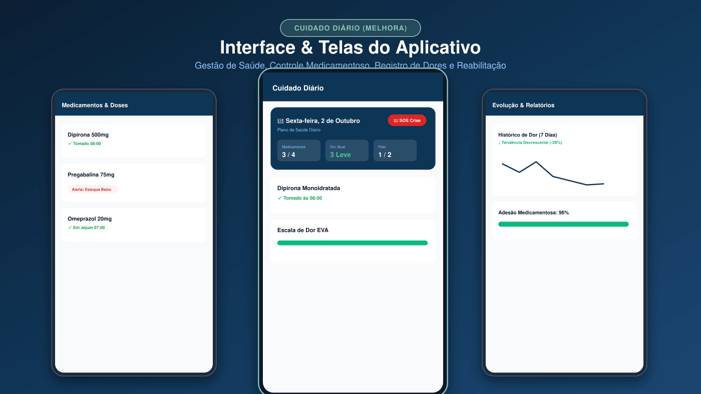
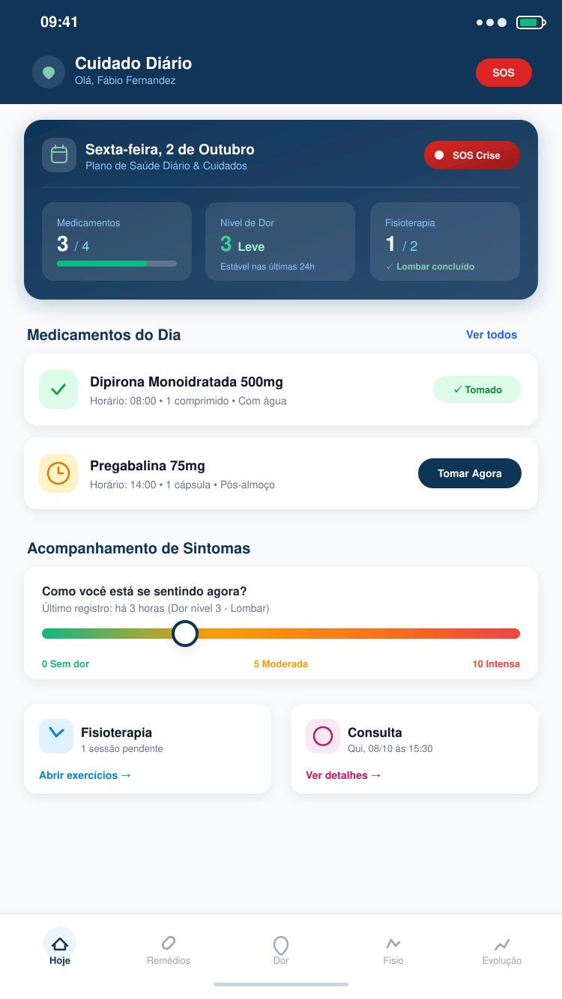
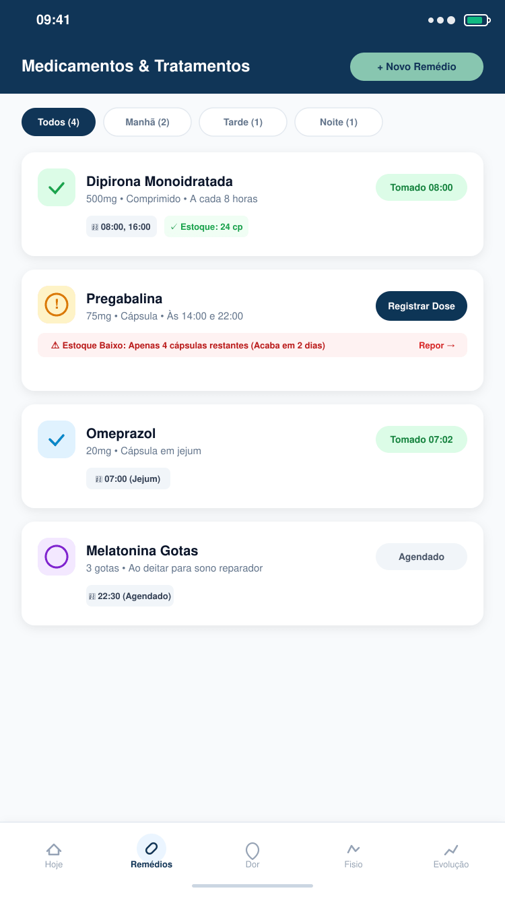
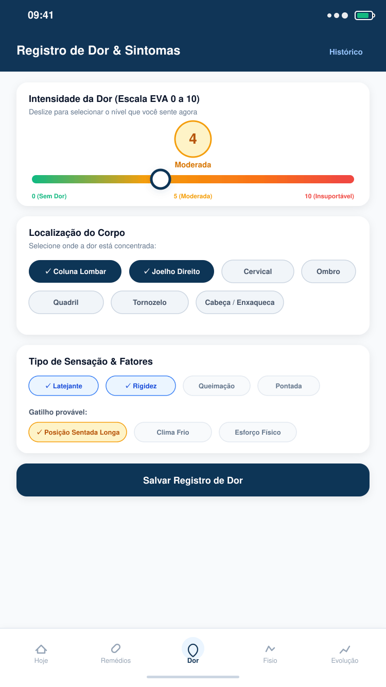
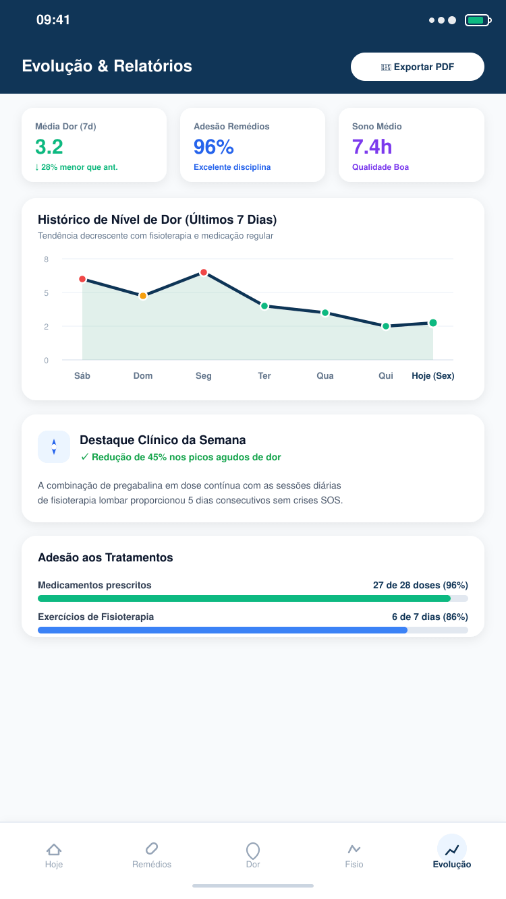
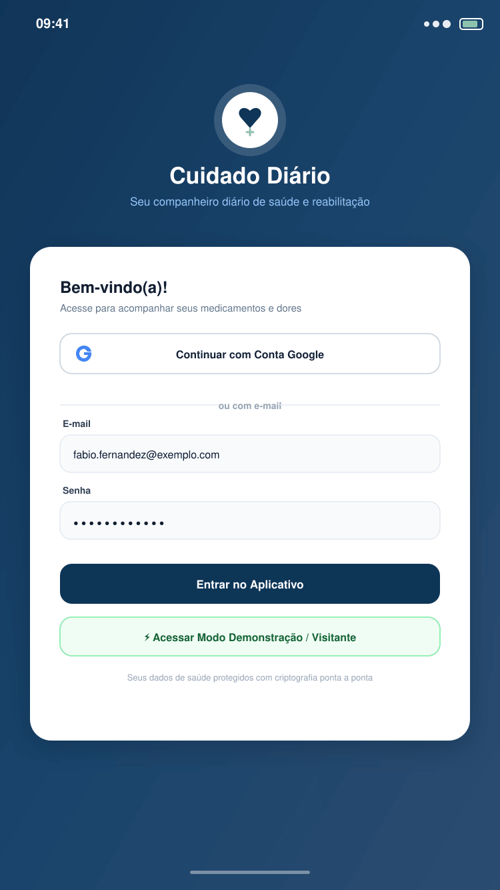
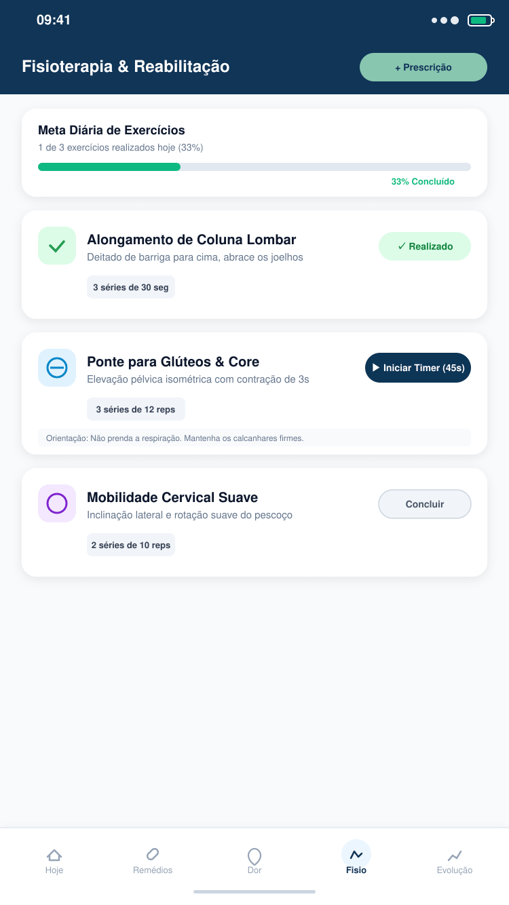

# Cuidado Diário (Melhora) — Gestão de Saúde e Reabilitação

Aplicativo web completo para acompanhamento diário de saúde, adesão medicamentosa, sessões de fisioterapia, escalas de dor/sintomas e agenda de consultas médicas.



---
## 🌐 Portal do Projeto (Documentação, Regras & Design)

O projeto conta com um **Portal do Projeto** interativo e completo em HTML/CSS/JS puro, acessível tanto no repositório quanto em execução no navegador:

- 🔗 **Arquivo no repositório**: [`docs/portal.html`](./docs/portal.html) (compatível com GitHub Pages em `docs/index.html`)
- 🌐 **No aplicativo em execução**: [`/portal.html` (servido estaticamente em qualquer ambiente)](https://outraperspectiva.github.io/Cuidado-Diario/)
- 🚀 **App Publicado na Vercel**: [cuidado-diario.vercel.app](https://cuidado-diario.vercel.app)
- 📦 **Repositório GitHub**: [github.com/outraperspectiva/Cuidado-Diario](https://github.com/outraperspectiva/Cuidado-Diario)

### Conteúdo do Portal:
1. **Visão Geral & Simulador Diário**:
   - Status atual da aplicação, mapa de módulos e papéis de usuário (*Paciente* e *Cuidador*).
   - **Simulador interativo "Um dia no app"**: teste em tempo real de alteração de estados de doses (Pendente → Tomada → Pulada) e fisioterapia.
2. **Identidade Visual & Escalas**:
   - Paleta de cores oficial (Petróleo `#103557`, Verde Cuidador `#88C6B0`, Névoa `#F8FAFC`, Alerta/Crise `#DC2626`) com botão de clique para copiar HEX.
   - Régua da escala analógica visual de dor de 0 a 10 com cálculo HSL dinâmico.
   - Especificação tipográfica (Bricolage Grotesque e Public Sans).
3. **Catálogo de Regras de Negócio (REQ-001 a REQ-050)**:
   - Filtros por categoria: *Contas*, *Medicamentos*, *Fisioterapia*, *Dor e Sintomas*, *Consultas* e *Privacidade (LGPD)*.
   - Fluxos de decisão (confirmação de dose e acionamento de SOS Crise) e mapeamento de pontos em aberto.
4. **Decisões de Arquitetura (ADRs)**:
   - Registro das decisões de projeto (ADR-001 a ADR-007: React 18, Redux Toolkit, Tailwind, Firebase/PostgreSQL, deploy multinuvem) e template padronizado para novas decisões.

---
## 📱 Telas do Aplicativo (Screenshots)

As capturas de tela oficiais e vetores do aplicativo estão salvos e versionados neste repositório na pasta [`docs/screenshots/`](./docs/screenshots/) e em [`public/screenshots/`](./public/screenshots/):

| 1. Tela Hoje (Dashboard & Card Azul) | 2. Gestão de Medicamentos & Doses |
| :---: | :---: |
|  |  |
| **Card Azul com Data formatada**, SOS Crise, progresso diário e remédios do turno. | Controle de horários (08:00, 14:00), alerta de estoque baixo e registro de doses. |

| 3. Registro de Dor & Sintomas (Escala EVA) | 4. Evolução Clínica & Relatórios |
| :---: | :---: |
|  |  |
| Régua de dor 0-10, seleção de membros (lombar, joelho) e fatores desencadeantes. | Gráfico semanal de tendência de dor, adesão medicamentosa e exportação para PDF. |

| 5. Autenticação & Modo Visitante | 6. Sessões de Fisioterapia & Reabilitação |
| :---: | :---: |
|  |  |
| Login Google, e-mail/senha e acesso imediato em modo demonstração. | Lista de exercícios prescritos, séries, repetições e timer em tempo real. |

---


## 🛠️ Tecnologias Principais

- **Frontend**: React 18, TypeScript, Tailwind CSS, Lucide React, Redux Toolkit.
- **Build Tool**: Vite.
- **Armazenamento e Autenticação**: Estrutura adaptável para **Firebase Firestore**, **PostgreSQL** ou bancos relacionais de nuvem (Cloud SQL, Supabase, Neon, Oracle ATP).

---

## 📋 Sumário de Implementação e Deploy

Este guia detalha o passo a passo de deploy e integração com bancos de dados nos três principais provedores solicitados:

1. [Google Cloud (GCP)](#1-implementação-no-google-cloud-gcp)
2. [Plataforma Vercel](#2-implementação-na-plataforma-vercel)
3. [Oracle Cloud Infrastructure (OCI)](#3-implementação-no-oracle-cloud-oci)
4. [Estrutura do Banco de Dados](#4-estrutura-do-modelo-de-dados)
5. [Variáveis de Ambiente](#5-variáveis-de-ambiente)

---

## 1. Implementação no Google Cloud (GCP)

No Google Cloud, há duas abordagens recomendadas conforme a arquitetura escolhida:
- **Opção 1.1 (Padrão Serverless NoSQL)**: Firebase Firestore + Cloud Run / Firebase Hosting.
- **Opção 1.2 (Relacional)**: Google Cloud SQL (PostgreSQL) + Google Cloud Run.

### 1.1. Opção com Firebase Firestore + Cloud Run

#### Passo 1: Criar o Projeto no Google Cloud / Firebase Console
1. Acesse o [Google Cloud Console](https://console.cloud.google.com/) ou o [Firebase Console](https://console.firebase.google.com/).
2. Crie um novo projeto (ex: `cuidado-diario-prod`).
3. Ative o **Firestore Database** no modo *Native*.
4. Ative a autenticação em **Firebase Authentication** (habilitando Provedor Google e E-mail/Senha).

#### Passo 2: Aplicar Regras de Segurança
O projeto já conta com o arquivo `firestore.rules` pronto para produção. Aplique as regras com o Firebase CLI:
```bash
npm install -g firebase-tools
firebase login
firebase use --add cuidado-diario-prod
firebase deploy --only firestore:rules
```

#### Passo 3: Deploy no Google Cloud Run
1. Crie o arquivo `Dockerfile` na raiz do projeto:
```dockerfile
FROM node:20-alpine AS build
WORKDIR /app
COPY package*.json ./
RUN npm ci
COPY . .
RUN npm run build

FROM nginx:alpine
COPY --from=build /app/dist /usr/share/nginx/html
COPY nginx.conf /etc/nginx/conf.d/default.conf
EXPOSE 3000
CMD ["nginx", "-g", "daemon off;"]
```

2. Crie o arquivo `nginx.conf` para redirecionamento de rotas SPA:
```nginx
server {
    listen 3000;
    location / {
        root /usr/share/nginx/html;
        index index.html index.htm;
        try_files $uri $uri/ /index.html;
    }
}
```

3. Realize o build e deploy no Cloud Run via Google Cloud CLI (`gcloud`):
```bash
# Definir o projeto
gcloud config set project cuidado-diario-prod

# Build da imagem no Artifact Registry ou Cloud Build
gcloud builds submit --tag gcr.io/cuidado-diario-prod/cuidado-diario-app

# Deploy no Cloud Run na porta 3000
gcloud run deploy cuidado-diario-app \
  --image gcr.io/cuidado-diario-prod/cuidado-diario-app \
  --platform managed \
  --region us-east1 \
  --port 3000 \
  --allow-unauthenticated
```

---

### 1.2. Opção com Google Cloud SQL (PostgreSQL) + Cloud Run

Caso utilize um backend Node.js/Express intermediário para queries SQL:

1. **Criar Instância Cloud SQL**:
   ```bash
   gcloud sql instances create cuidado-diario-db \
     --database-version=POSTGRES_15 \
     --tier=db-f1-micro \
     --region=us-east1
   ```
2. **Criar o Banco e Usuário**:
   ```bash
   gcloud sql databases create cuidado_diario --instance=cuidado-diario-db
   gcloud sql users create appuser --instance=cuidado-diario-db --password='SENHA_SEGURA_AQUI'
   ```
3. **Conectar via Cloud Run Cloud SQL Proxy**:
   Adicione a flag `--set-cloudsql-instances` no deploy do Cloud Run e injete a variável de conexão:
   ```bash
   DATABASE_URL="postgresql://appuser:SENHA_SEGURA_AQUI@/cuidado_diario?host=/cloudsql/cuidado-diario-prod:us-east1:cuidado-diario-db"
   ```

---

## 2. Implementação na Plataforma Vercel

A Vercel oferece suporte nativo para aplicações React/Vite com roteamento SPA e conexão simplificada com bancos de dados serverless.

### 2.1. Configuração do Projeto na Vercel

1. Suba o código para um repositório no **GitHub**, **GitLab** ou **Bitbucket**.
2. Acesse [vercel.com](https://vercel.com/) e clique em **"Add New Project"** -> **"Import"**.
3. Selecione o framework preset: **Vite**.
   - **Build Command**: `npm run build`
   - **Output Directory**: `dist`
   - **Install Command**: `npm install`
4. Crie o arquivo `vercel.json` na raiz do projeto para garantir o fallback de rotas SPA:
```json
{
  "rewrites": [
    { "source": "/(.*)", "destination": "/index.html" }
  ]
}
```

---

### 2.2. Integração de Banco de Dados na Vercel

Você pode conectar o banco de dados das seguintes formas:

#### Opção A: Vercel Storage (Neon Serverless PostgreSQL)
1. No painel do seu projeto na Vercel, clique na aba **Storage**.
2. Clique em **Create Database** e selecione **Postgres (Neon)**.
3. Escolha a região (ex: `Washington D.C. (iad1)` ou `São Paulo (gru1)` se disponível).
4. A Vercel injeta automaticamente as variáveis de ambiente:
   - `POSTGRES_URL`
   - `POSTGRES_PRISMA_URL`
   - `POSTGRES_URL_NON_POOLING`
   - `POSTGRES_USER`
   - `POSTGRES_HOST`
   - `POSTGRES_PASSWORD`
   - `POSTGRES_DATABASE`

#### Opção B: Supabase (PostgreSQL)
1. Acesse [supabase.com](https://supabase.com/) e crie um projeto.
2. Na Vercel Marketplace, conecte a integração oficial do **Supabase**.
3. Obtenha as variáveis no painel do Supabase:
   - `VITE_SUPABASE_URL=https://xyzcompany.supabase.co`
   - `VITE_SUPABASE_ANON_KEY=eyJhbGciOi...`
4. Configure as variáveis na Vercel em **Settings > Environment Variables**.

#### Opção C: Firebase Firestore na Vercel
1. Gere uma chave de serviço ou utilize a configuração Web SDK do Firebase.
2. Adicione as credenciais nas variáveis de ambiente da Vercel:
   - `VITE_FIREBASE_API_KEY`
   - `VITE_FIREBASE_AUTH_DOMAIN`
   - `VITE_FIREBASE_PROJECT_ID`
   - `VITE_FIREBASE_STORAGE_BUCKET`
   - `VITE_FIREBASE_MESSAGING_SENDER_ID`
   - `VITE_FIREBASE_APP_ID`

---

## 3. Implementação no Oracle Cloud (OCI)

O Oracle Cloud oferece uma das camadas gratuitas (*Always Free Tier*) mais completas, permitindo rodar tanto bancos NoSQL/PostgreSQL quanto **Autonomous Database**.

---

### 3.1. Provisionamento do Banco de Dados no OCI

#### Opção A: OCI Autonomous Database (Always Free)
1. Acesse a consola do [Oracle Cloud (OCI)](https://cloud.oracle.com/).
2. Vá em **Oracle Database** > **Autonomous Databases**.
3. Clique em **Create Autonomous Database**:
   - **Workload Type**: *Transaction Processing* (ATP).
   - Marque a caixa: **Always Free**.
   - Defina o nome (ex: `cuidado_diario_db`).
   - Crie a senha do usuário `ADMIN`.
   - **Network Access**: Escolha *Secure access from everywhere* (ou limite por IPs da sua VCN).
4. Faça o download do **Client Credentials (Wallet)** ou utilize a conexão via REST Data Services (ORDS) / driver Node.js `oracledb`.

#### Opção B: OCI Database with PostgreSQL
1. No menu lateral, acesse **Databases** > **PostgreSQL**.
2. Crie um sistema de banco de dados gerenciado:
   - Selecione a sua VCN e Subnet privada.
   - Configure a CPU, armazenamento e credenciais de administrador.
   - Libere a porta `5432` na *Security List* da Subnet para acesso interno da VM de aplicação.

---

### 3.2. Deploy da Aplicação no OCI Compute (Instância Always Free)

1. **Criar a Máquina Virtual**:
   - Acesse **Compute** > **Instances** > **Create Instance**.
   - Imagem: **Ubuntu 22.04 LTS** ou **Oracle Linux 8/9**.
   - Shape: **VM.Standard.E2.1.Micro** (Always Free) ou **VM.Standard.A1.Flex** (Ampere ARM, até 4 OCPUs e 24GB RAM gratuitos).
   - Baixe sua chave SSH privada (`.key`).

2. **Configuração da Rede (VCN & Ingress Rules)**:
   - No painel da VCN, edite a **Default Security List for VCN**:
   - Adicione uma regra de entrada (*Ingress Rule*):
     - **Source CIDR**: `0.0.0.0/0`
     - **IP Protocol**: `TCP`
     - **Destination Port Range**: `80, 443, 3000`

3. **Instalação e Configuração no Servidor**:
   Conecte via SSH:
   ```bash
   ssh -i sua-chave.key ubuntu@IP_PUBLICO_OCI
   ```

   Atualize os pacotes e instale Docker e Nginx:
   ```bash
   sudo apt update && sudo apt upgrade -y
   sudo apt install -y docker.io docker-compose git nginx certbot python3-certbot-nginx
   sudo systemctl enable docker
   sudo usermod -aG docker $USER
   ```

4. **Clonar e Executar a Aplicação**:
   ```bash
   git clone https://github.com/seu-usuario/cuidado-diario.git
   cd cuidado-diario
   npm install
   npm run build
   ```

5. **Configurar o Nginx como Reverse Proxy**:
   Crie `/etc/nginx/sites-available/cuidado-diario`:
   ```nginx
   server {
       listen 80;
       server_name seu-dominio.com.br;

       location / {
           root /home/ubuntu/cuidado-diario/dist;
           index index.html;
           try_files $uri $uri/ /index.html;
       }
   }
   ```

   Ative o site e configure SSL gratuito:
   ```bash
   sudo ln -s /etc/nginx/sites-available/cuidado-diario /etc/nginx/sites-enabled/
   sudo nginx -t
   sudo systemctl restart nginx
   sudo certbot --nginx -d seu-dominio.com.br
   ```

---

## 4. Estrutura do Modelo de Dados

O modelo de dados do aplicativo está especificado em conformidade com o arquivo `firebase-blueprint.json` e pode ser mapeado tanto para NoSQL (Firestore) quanto para tabelas SQL relacionais:

### Tabelas / Coleções:

1. **`users`**:
   - `uid` (PK, string): Identificador único do usuário.
   - `email` (string): E-mail de login.
   - `name` (string): Nome do paciente ou cuidador.
   - `role` (string): `'patient'` ou `'caregiver'`.
   - `createdAt` (timestamp).

2. **`medications`**:
   - `id` (PK, string): ID do medicamento.
   - `userId` (FK, string): Dono do registro.
   - `name` (string): Nome comercial/genérico.
   - `dosage` (string): Ex: "50mg", "1 comprimido".
   - `form` (string): `'pill'`, `'drops'`, `'injection'`, etc.
   - `times` (array/json): Horários prescritos (ex: `["08:00", "20:00"]`).
   - `stock` (integer): Quantidade atual em estoque.
   - `instructions` (text): Recomendações médicas.

3. **`medicationIntakes`** (Registro de doses):
   - `id` (PK, string)
   - `medicationId` (FK, string)
   - `scheduledTime` (string): Ex: "08:00"
   - `takenTime` (timestamp): Horário da confirmação
   - `status` (string): `'taken'`, `'skipped'`, `'pending'`
   - `date` (string): Data YYYY-MM-DD

4. **`physiotherapyPrescriptions`**:
   - `id` (PK, string)
   - `userId` (FK, string)
   - `title` (string): Nome do exercício ou protocolo.
   - `scheduledTimes` (array/json): Ex: `["09:00", "16:00"]`
   - `sets` (integer): Séries.
   - `repetitions` (integer): Repetições.
   - `holdTimeSeconds` (integer): Tempo de sustentação.

5. **`physiotherapyExecutions`** (Registro de atividades de fisioterapia):
   - `id` (PK, string)
   - `prescriptionId` (FK, string)
   - `sessionNumber` (integer)
   - `totalSessions` (integer)
   - `scheduledTime` (string)
   - `completedAt` (timestamp)
   - `status` (string): `'completed'`, `'pending'`
   - `date` (string): Data YYYY-MM-DD

6. **`painLogs`**:
   - `id` (PK, string)
   - `userId` (FK, string)
   - `level` (integer): Escala de 0 a 10.
   - `location` (string): Região do corpo afetada.
   - `type` (string): Queimação, pontada, latejante, etc.
   - `isCrisis` (boolean): Flag de crise aguda (SOS).
   - `timestamp` (timestamp)

7. **`appointments`**:
   - `id` (PK, string)
   - `userId` (FK, string)
   - `doctorName` (string): Nome do profissional.
   - `specialty` (string): Ex: "Ortopedia", "Fisioterapia".
   - `date` (string): Data da consulta.
   - `time` (string): Horário da consulta.
   - `location` (string): Endereço ou link teleconsulta.
   - `status` (string): `'scheduled'`, `'completed'`, `'canceled'`

---

## 5. Variáveis de Ambiente

Crie um arquivo `.env` na raiz do projeto com as variáveis necessárias para o seu provedor de banco de dados:

```env
# Configurações do Provedor de Autenticação / Firestore
VITE_FIREBASE_API_KEY=sua_api_key
VITE_FIREBASE_AUTH_DOMAIN=seu_projeto.firebaseapp.com
VITE_FIREBASE_PROJECT_ID=seu_projeto_id
VITE_FIREBASE_STORAGE_BUCKET=seu_projeto.appspot.com
VITE_FIREBASE_MESSAGING_SENDER_ID=seu_sender_id
VITE_FIREBASE_APP_ID=seu_app_id

# (Opcional) Configurações de API REST / PostgreSQL (Vercel Postgres, Supabase ou Cloud SQL)
VITE_API_BASE_URL=https://api.seudominio.com.br
VITE_SUPABASE_URL=https://sua-instancia.supabase.co
VITE_SUPABASE_ANON_KEY=sua_chave_anon_key
```

---

## 🚀 Comandos Rápidos de Desenvolvimento

```bash
# Instalar dependências
npm install

# Iniciar servidor de desenvolvimento (Porta 3000)
npm run dev

# Verificar validação de tipos TypeScript
npm run lint

# Gerar build de produção
npm run build
```
