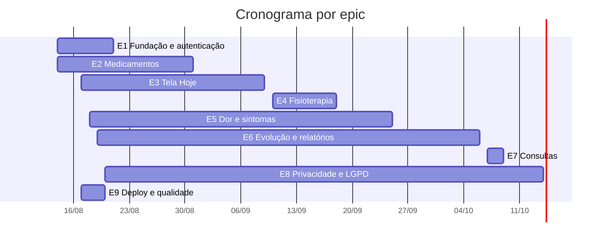

# GOV-0003: Cronograma e Responsabilidades por Epic e Issue

| Campo | Valor |
| --- | --- |
| ID | GOV-0003 |
| Status | Rascunho |
| Data | 2026-10-07 |
| Responsável | Mantenedores do projeto |
| Substitui / Substituído por | n/a |
| Relacionados | [GOV-0002](GOV-0002-ROTEIRO-DE-REUNIOES-SCRUM.md), [PRD-000](../products/PRD-000-INDEX.md), [TDD-000](../tdds/TDD-000-INDEX.md) |

## 1. Objetivo

Atribuir um **papel responsável** e um **papel de apoio** a cada epic e issue do projeto Cuidado Diário e registrar um **cronograma estimado** a partir do início em **14/08/2026**.

## 2. Premissas

- **Linha de base de planejamento.** As datas são estimativas calculadas, não o histórico real. Como o app já está publicado, confira no Kanban o que foi entregue e atualize as datas.
- **Início:** sexta-feira, 14/08/2026. Sprints de 10 dias úteis, conforme o [GOV-0002](GOV-0002-ROTEIRO-DE-REUNIOES-SCRUM.md).
- **Calendário:** dias úteis (segunda a sexta), sem os feriados nacionais do período (07/09, 12/10, 02/11, 20/11 e 25/12). Ajuste para feriados locais.
- **Equipe:** 8 funções, com **1 pessoa por função** (8 pessoas no total), cada uma executando uma issue por vez. Quem acumular funções deve somar as cargas e as datas se deslocam.
- **Durações** são as estimativas de 1 a 3 dias de cada issue. Prazos já consideram as dependências da coluna "Depende de".
- **Issues "D"** são decisões de regra de negócio, de 1 dia, que bloqueiam issues de implementação. Foram criadas a partir dos pontos em aberto dos PRDs.
- As funções seguem a divisão de especialistas já definida, sem alterações. Preencha o nome de cada pessoa na seção 3.

## 3. Equipe e funções

| # | Função | Atuação | Qtd | Pessoa | Issues como responsável | Issues como apoio | Dias como responsável |
| --- | --- | --- | --- | --- | --- | --- | --- |
| 1 | PO | Regras de negócio, decisões e aceite | 1 | _(nome)_ | 4 | 2 | 4 |
| 2 | UX/UI | Identidade visual, telas e usabilidade | 1 | _(nome)_ | 0 | 6 | 0 |
| 3 | Dev frontend | React, TypeScript, Tailwind e Redux | 1 | _(nome)_ | 23 | 2 | 40 |
| 4 | Dev backend/dados | Modelo de dados, Firestore ou SQL e regras de segurança | 1 | _(nome)_ | 3 | 9 | 7 |
| 5 | DevOps | Docker, nginx, deploy e CI | 1 | _(nome)_ | 3 | 2 | 3 |
| 6 | QA | Critérios de aceite e testes (apoio na Definição de Pronto de todas as issues) | 1 | _(nome)_ | 0 | 1 | 0 |
| 7 | Especialista LGPD | Política de privacidade e consentimento | 1 | _(nome)_ | 1 | 2 | 2 |
| 8 | Consultor de saúde | Validação das regras clínicas | 1 | _(nome)_ | 0 | 10 | 0 |

**Total:** 8 funções, 8 pessoas.

**Scrum Master:** a função não está na lista de responsabilidades. O [GOV-0002](GOV-0002-ROTEIRO-DE-REUNIOES-SCRUM.md) pede um SM nomeado, então escolha uma das 8 pessoas para facilitar as reuniões. Isso acrescenta carga a quem for escolhido.

## 4. Calendário das sprints

| Sprint | Início | Fim | Planejamento | Revisão e retrospectiva |
| --- | --- | --- | --- | --- |
| 1 | 14/08/2026 | 27/08/2026 | 14/08/2026 | 27/08/2026 |
| 2 | 28/08/2026 | 11/09/2026 | 28/08/2026 | 11/09/2026 |
| 3 | 14/09/2026 | 25/09/2026 | 14/09/2026 | 25/09/2026 |
| 4 | 28/09/2026 | 09/10/2026 | 28/09/2026 | 09/10/2026 |
| 5 | 13/10/2026 | 26/10/2026 | 13/10/2026 | 26/10/2026 |

## 5. Resumo por epic

| Epic | Título | PRD / TDD | Responsável principal | Início | Fim | Sprints |
| --- | --- | --- | --- | --- | --- | --- |
| E1 | Fundação e autenticação | PRD-0001 | Dev frontend | 14/08/2026 | 21/08/2026 | 1 |
| E2 | Medicamentos | PRD-0002 | Dev frontend | 14/08/2026 | 31/08/2026 | 1 a 2 |
| E3 | Tela Hoje | PRD-0001 | Dev frontend | 17/08/2026 | 09/09/2026 | 1 a 2 |
| E4 | Fisioterapia | PRD-0003 | Dev frontend | 10/09/2026 | 18/09/2026 | 2 a 3 |
| E5 | Dor e sintomas | PRD-0004 | Dev frontend | 18/08/2026 | 25/09/2026 | 1 a 3 |
| E6 | Evolução e relatórios | PRD-0004 | Dev frontend | 19/08/2026 | 06/10/2026 | 1 a 4 |
| E7 | Consultas | PRD-0005 | Dev frontend | 07/10/2026 | 09/10/2026 | 4 |
| E8 | Privacidade e LGPD | PRD-0001 | Especialista LGPD | 20/08/2026 | 14/10/2026 | 1 a 5 |
| E9 | Deploy e qualidade | TDD-0002 | DevOps | 17/08/2026 | 20/08/2026 | 1 |

**Término estimado do escopo:** 14/10/2026 (sprint 5).

### Visão em Gantt

## 6. Epics e issues

Legenda de duração: 1d, 2d ou 3d.

### E1. Fundação e autenticação (PRD-0001)

| ID | Issue | Dur. | Responsável | Apoio | Depende de | Início | Fim | Sprint |
| --- | --- | --- | --- | --- | --- | --- | --- | --- |
| 1.1 | Configurar Vite, React, TypeScript, Tailwind e Redux | 1d | Dev frontend | DevOps | - | 14/08/2026 | 14/08/2026 | 1 |
| 1.2 | Aplicar paleta e fontes como tokens | 1d | Dev frontend | UX/UI | 1.1 | 17/08/2026 | 17/08/2026 | 1 |
| 1.3 | Login com Google e e-mail/senha | 2d | Dev frontend | Dev backend/dados | 1.1 | 18/08/2026 | 19/08/2026 | 1 |
| 1.4 | Modo visitante com dados de demonstração | 2d | Dev frontend | UX/UI | 1.3 | 20/08/2026 | 21/08/2026 | 1 |
| 1.5 | Regras de segurança por usuário no Firestore | 2d | Dev backend/dados | DevOps | - | 14/08/2026 | 17/08/2026 | 1 |

### E2. Medicamentos (PRD-0002)

| ID | Issue | Dur. | Responsável | Apoio | Depende de | Início | Fim | Sprint |
| --- | --- | --- | --- | --- | --- | --- | --- | --- |
| 2.1 | Cadastrar e editar medicamento | 2d | Dev frontend | Dev backend/dados | 1.2, 1.5 | 24/08/2026 | 25/08/2026 | 1 |
| D2 | Decisão: valor de referência para estoque baixo e dose atrasada | 1d | PO | Consultor de saúde | - | 14/08/2026 | 14/08/2026 | 1 |
| 2.2 | Gerar doses a partir dos horários | 2d | Dev backend/dados | Consultor de saúde | 2.1 | 26/08/2026 | 27/08/2026 | 1 |
| 2.3 | Registrar dose como tomada ou pulada | 1d | Dev frontend | Consultor de saúde | 2.2 | 28/08/2026 | 28/08/2026 | 2 |
| 2.4 | Alertar estoque baixo | 1d | Dev frontend | Consultor de saúde | 2.3, D2 | 31/08/2026 | 31/08/2026 | 2 |

### E3. Tela Hoje (PRD-0001)

| ID | Issue | Dur. | Responsável | Apoio | Depende de | Início | Fim | Sprint |
| --- | --- | --- | --- | --- | --- | --- | --- | --- |
| 3.1 | Card Azul com data formatada | 1d | Dev frontend | UX/UI | 1.2 | 01/09/2026 | 01/09/2026 | 2 |
| 3.2 | Progresso diário e medicamentos do turno | 2d | Dev frontend | UX/UI | 2.3, 3.1 | 02/09/2026 | 03/09/2026 | 2 |
| D1 | Decisão: o que o SOS Crise aciona e para quem | 1d | PO | Consultor de saúde | - | 17/08/2026 | 17/08/2026 | 1 |
| 3.3 | Botão SOS Crise | 3d | Dev frontend | Consultor de saúde | 3.2, D1 | 04/09/2026 | 09/09/2026 | 2 |

### E4. Fisioterapia (PRD-0003)

| ID | Issue | Dur. | Responsável | Apoio | Depende de | Início | Fim | Sprint |
| --- | --- | --- | --- | --- | --- | --- | --- | --- |
| 4.1 | Cadastrar prescrição de exercícios | 2d | Dev frontend | Dev backend/dados | 1.5 | 10/09/2026 | 11/09/2026 | 2 |
| 4.2 | Listar exercícios do dia | 1d | Dev frontend | UX/UI | 4.1 | 14/09/2026 | 14/09/2026 | 3 |
| 4.3 | Timer em tempo real | 2d | Dev frontend | Consultor de saúde | 4.2 | 15/09/2026 | 16/09/2026 | 3 |
| 4.4 | Registrar conclusão da sessão | 2d | Dev frontend | Dev backend/dados | 4.3 | 17/09/2026 | 18/09/2026 | 3 |

### E5. Dor e sintomas (PRD-0004)

| ID | Issue | Dur. | Responsável | Apoio | Depende de | Início | Fim | Sprint |
| --- | --- | --- | --- | --- | --- | --- | --- | --- |
| D3 | Decisão: critério para classificar registro como crise | 1d | PO | Consultor de saúde | - | 18/08/2026 | 18/08/2026 | 1 |
| 5.1 | Régua de dor 0 a 10 com cor dinâmica | 2d | Dev frontend | UX/UI | 1.2 | 21/09/2026 | 22/09/2026 | 3 |
| 5.2 | Formulário de local, tipo e fatores desencadeantes | 2d | Dev frontend | Dev backend/dados | 5.1 | 23/09/2026 | 24/09/2026 | 3 |
| 5.3 | Marcar registro como crise | 1d | Dev frontend | Consultor de saúde | 5.2, D3 | 25/09/2026 | 25/09/2026 | 3 |

### E6. Evolução e relatórios (PRD-0004)

| ID | Issue | Dur. | Responsável | Apoio | Depende de | Início | Fim | Sprint |
| --- | --- | --- | --- | --- | --- | --- | --- | --- |
| 6.1 | Gráfico semanal de dor | 2d | Dev frontend | Dev backend/dados | 5.2 | 28/09/2026 | 29/09/2026 | 4 |
| 6.2 | Gráfico de adesão medicamentosa | 2d | Dev frontend | Dev backend/dados | 2.3 | 30/09/2026 | 01/10/2026 | 4 |
| D4 | Decisão: conteúdo e período do relatório em PDF | 1d | PO | Consultor de saúde | - | 19/08/2026 | 19/08/2026 | 1 |
| 6.3 | Exportar relatório em PDF | 3d | Dev frontend | PO | 6.1, 6.2, D4 | 02/10/2026 | 06/10/2026 | 4 |

### E7. Consultas (PRD-0005)

| ID | Issue | Dur. | Responsável | Apoio | Depende de | Início | Fim | Sprint |
| --- | --- | --- | --- | --- | --- | --- | --- | --- |
| 7.1 | Cadastrar e editar consulta | 2d | Dev frontend | Dev backend/dados | 1.5 | 07/10/2026 | 08/10/2026 | 4 |
| 7.2 | Alterar status da consulta | 1d | Dev frontend | Dev backend/dados | 7.1 | 09/10/2026 | 09/10/2026 | 4 |

### E8. Privacidade e LGPD (PRD-0001)

| ID | Issue | Dur. | Responsável | Apoio | Depende de | Início | Fim | Sprint |
| --- | --- | --- | --- | --- | --- | --- | --- | --- |
| 8.1 | Redigir política de privacidade | 2d | Especialista LGPD | PO | 1.3 | 20/08/2026 | 21/08/2026 | 1 |
| 8.2 | Registrar consentimento no primeiro acesso | 2d | Dev frontend | Especialista LGPD | 8.1 | 13/10/2026 | 14/10/2026 | 5 |
| 8.3 | Exportar e excluir dados do usuário | 3d | Dev backend/dados | Especialista LGPD | 8.1, 1.5 | 28/08/2026 | 01/09/2026 | 2 |

### E9. Deploy e qualidade (TDD-0002)

| ID | Issue | Dur. | Responsável | Apoio | Depende de | Início | Fim | Sprint |
| --- | --- | --- | --- | --- | --- | --- | --- | --- |
| 9.3 | Pipeline de CI com lint e build | 1d | DevOps | QA | 1.1 | 17/08/2026 | 17/08/2026 | 1 |
| 9.1 | Dockerfile e nginx para Cloud Run | 1d | DevOps | Dev frontend | 1.1 | 18/08/2026 | 18/08/2026 | 1 |
| 9.2 | vercel.json e variáveis de ambiente | 1d | DevOps | Dev frontend | 1.3 | 20/08/2026 | 20/08/2026 | 1 |

## 7. Carga por papel

| Papel | Dias de trabalho | Primeira issue | Última issue |
| --- | --- | --- | --- |
| Dev frontend | 40 | 14/08/2026 | 14/10/2026 |
| Dev backend/dados | 7 | 14/08/2026 | 01/09/2026 |
| DevOps | 3 | 17/08/2026 | 20/08/2026 |
| PO | 4 | 14/08/2026 | 19/08/2026 |
| Especialista LGPD | 2 | 20/08/2026 | 21/08/2026 |

O **Dev frontend** concentra 40 dias de trabalho e é o gargalo do cronograma. Com duas pessoas no papel, o término tende a ser bem anterior a 14/10/2026. Para encurtar o caminho crítico, as issues de E4, E5 e E7 podem rodar em paralelo às de E2 e E3.

## 8. Pontos de atenção

- **Regra clínica:** issues com consultor de saúde como apoio devem ter revisão dele antes de irem para produção.
- **Decisões D1 a D4:** devem estar fechadas antes do início das issues que bloqueiam. Se atrasarem, o prazo das dependentes se desloca.
- **LGPD:** a política (8.1) e o consentimento (8.2) dependem do login (1.3). Se o app já coleta dados de usuários em produção, antecipe o epic E8.
- **Replanejamento:** atualize este documento no Planejamento da Sprint, quando a capacidade real ou as prioridades mudarem.
