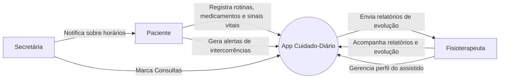

```mermaid
flowchart LR
    %% Definição de Atores
    P[Paciente]
    SE[Secretária]
    F[Fisioterapeuta]
    
    %% Nó Central
    S((App Cuidado-Diário))

    %% Relações e Permissões
    P -->|Registra rotinas, medicamentos e sinais vitais| S
    P -->|Gera alertas de intercorrências| S
    
    F -->|Acompanha relatórios e evolução| S
    F -->|Gerencia perfil do assistido| S
    
    SE -->|Marca Consultas| S
    

    %% Retornos do Sistema
    SE -->|Notifica sobre horários| P
    S -->|Envia relatórios de evolução| F
```
