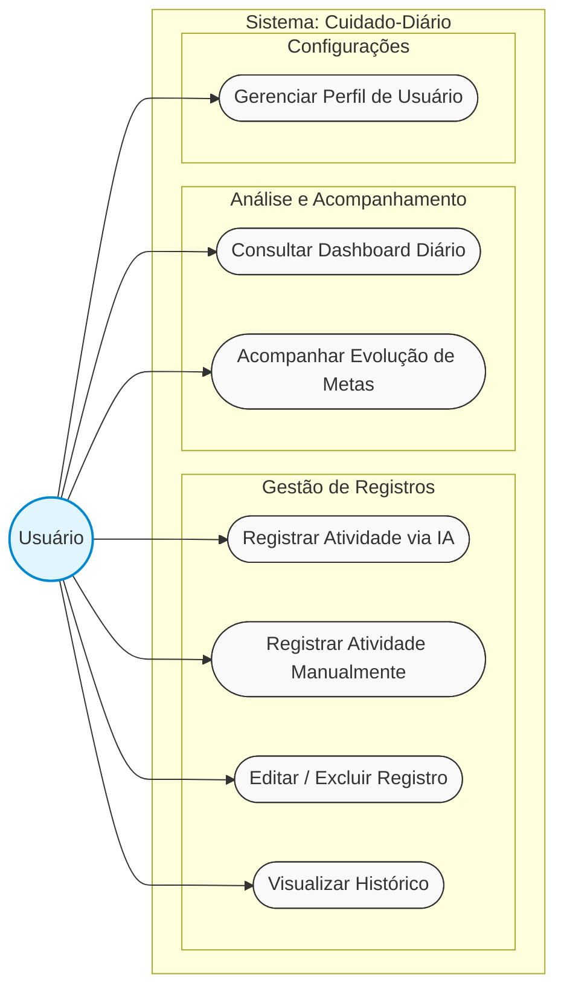

```mermaid
flowchart LR
    %% Definição do Ator
    U((Usuário))

    %% Agrupamento (Macro Casos de Uso)
    subgraph Cuidado_Diario [Sistema: Cuidado-Diário]
        
        subgraph Gestao [Gestão de Registros]
            UC1([Registrar Atividade via IA])
            UC2([Registrar Atividade Manualmente])
            UC3([Editar / Excluir Registro])
            UC4([Visualizar Histórico])
        end
        
        subgraph Analise [Análise e Acompanhamento]
            UC5([Consultar Dashboard Diário])
            UC6([Acompanhar Evolução de Metas])
        end
        
        subgraph Config [Configurações]
            UC7([Gerenciar Perfil de Usuário])
        end
        
    end

    %% Relacionamentos
    U --> UC1
    U --> UC2
    U --> UC3
    U --> UC4
    U --> UC5
    U --> UC6
    U --> UC7

    %% Estilização Básica
    classDef default fill:#f9f9f9,stroke:#333,stroke-width:1px;
    classDef actor fill:#e1f5fe,stroke:#0288d1,stroke-width:2px;
    class U actor
```
